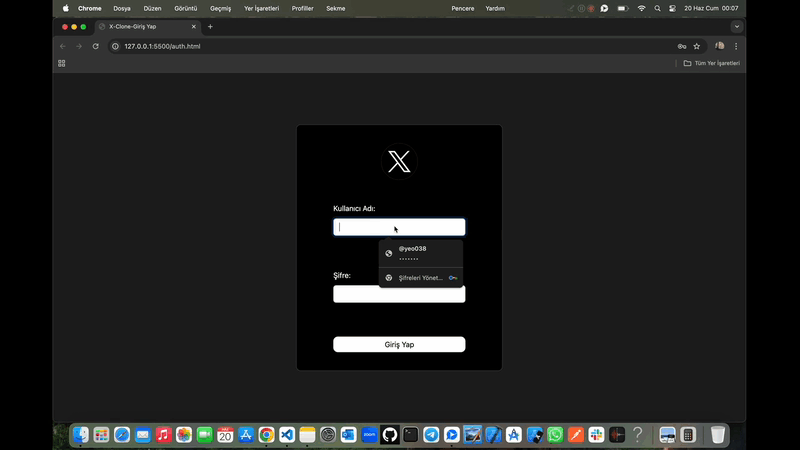

# X-Clone-Js 🐦

<li>Bu proje Js ile hazırlanmış X-Clone arayüzüdür.</li>
<li>Kullanıcı profili ve detay sayfası mevcuttur.</li>
<li>Tweetlere ait beğeni,alıntı,retweet,like özelliği entegre edilmiştir.</li>
<li>Kullanıcı dostu modern responsive tasarımı vardır.</li>

# Kullanılan Teknolojiler 🎨

<li>⭐ JS</li>
<li>⭐ SCSS</li>
<li>⭐ Apı</li>
<li>⭐ Bootstrap</li>
<li>⭐ Moment</li>
<li>⭐ Bootstrap-İcons</li>

# Ekran Görüntüsü 🎥
    

# İletişim 📩
yunusemreoral@hotmail.com.tr
